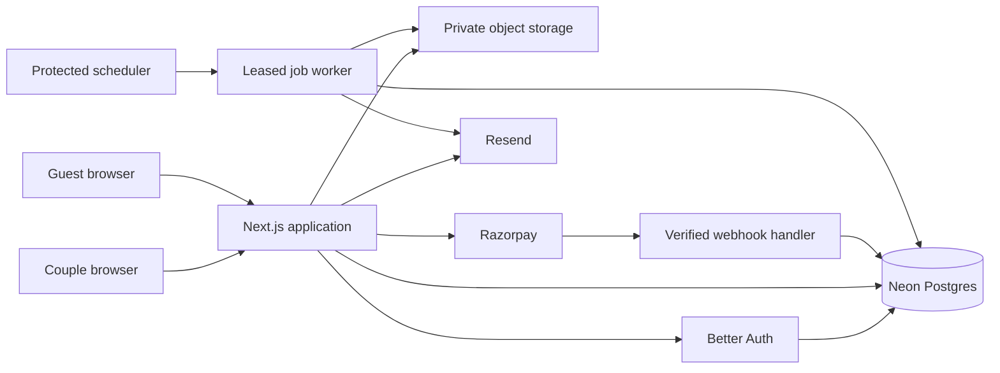

# Wedding Adventure — Production Implementation Plan

Version 1.1 · 6 October 2026 · Status: application implemented; local verification complete for core journeys; external launch gates remain

## 1. Outcome and authority

Build the complete first release in [PRD.md](PRD.md), with the luxury art direction in [DESIGN_SYSTEM.md](DESIGN_SYSTEM.md). Neon and Better Auth are confirmed user requirements. The remaining stack and operational choices below are implementation defaults, subject to evidence from integration tests and account availability.

The repository now contains the Next.js application, database migration, original visual/audio assets, automated tests, and operational documentation. Preserve the existing implementation and user-owned `.env.local` when continuing.

Implementation evidence is recorded in [docs/VERIFICATION.md](docs/VERIFICATION.md). [README.md](README.md) provides local and configured-Neon startup instructions. P0–P6 application features and the P7 lifecycle/monitoring code are implemented. P7 external verification and P8 production release are incomplete: live-provider validation, native-language review, physical-device testing, production load/restore drills, and deployment remain launch gates. The phase descriptions below retain their acceptance criteria; they are not blanket claims that every external check has passed.

The PRD defines behavior and scope; this plan defines construction order and technical decisions; the design system defines presentation; [LAUNCH_CHECKLIST.md](LAUNCH_CHECKLIST.md) records release evidence. User instructions take precedence if any document conflicts.

Production readiness means reliable money/data flows, accessible and polished interactions, tested deployment and recovery, and real integrations configured. The final public launch is a separate milestone from local implementation and staging verification.

## 2. Selected architecture

| Layer | Choice | Purpose |
| --- | --- | --- |
| Application | Next.js App Router, React, TypeScript | One application for marketing, owner workspace, guest invitations, and server endpoints |
| Styling | Tailwind CSS, shadcn/ui, custom semantic tokens | Consistent accessible primitives with a bespoke luxury identity |
| Motion | CSS first; Motion where needed | Restrained feedback and the five-scene adventure |
| Database | Neon Postgres | Durable relational data, transactions, isolated development environments |
| Schema/query layer | Drizzle ORM + reviewed SQL migrations | Typed access and one migration history |
| Database driver | `pg` in the Node.js runtime | Transaction-capable shared connection pool; avoid an HTTP-only transaction mismatch |
| Authentication | Better Auth + Drizzle adapter + magic-link plugin | App-owned authentication, Neon-backed users/sessions, verified email access |
| Email | Resend | Sign-in links and essential owner publication/expiry notices |
| Object storage | Private S3-compatible storage; proposed default Cloudflare R2 | Source uploads, optimized media, and generated social images |
| Image processing | Sharp in bounded Node.js jobs | Validation, orientation, metadata removal, responsive variants |
| Payments | Razorpay Standard Checkout | Proposed INR one-time checkout, conditional on merchant activation |
| Hosting | Vercel Node.js deployment | Web hosting and server routes; validate account/runtime limits before launch |
| Jobs | Postgres outbox + leased workers triggered by a protected scheduler | Durable media, publication follow-up, reconciliation, cleanup, and email |
| Rate limiting | Database-backed Better Auth limits and atomic application counters | Consistent limits across instances without adding a separate cache service initially |
| Validation/forms | Zod + React Hook Form | Shared content contracts and accessible error handling |
| Verification | Vitest, Playwright, axe integration | Domain, integration, journey, accessibility, and visual checks |
| Monitoring | Structured redacted logs + error tracking, proposed Sentry | Detect actionable failures without recording wedding/guest content |

Use currently supported mutually compatible stable releases and commit a lockfile. Do not bake guessed version numbers into the plan. Use pnpm unless existing project configuration specifies another package manager.

The storage choice is independent of Neon and isolated behind an S3 adapter. Its private upload model is supported by [R2 presigned URLs](https://developers.cloudflare.com/r2/api/s3/presigned-urls/). Do not enable public bucket access for wedding uploads.

### Architecture map



Browsers never receive database credentials. Public page reads use a dedicated published-content query, not an owner query with fields hidden in the UI.

## 3. Repository and module structure

```text
src/
  app/
    (marketing)/                 home, demo, pricing content, policy pages
    (auth)/sign-in/              email entry and verification-result screens
    (owner)/dashboard/           weddings, editor, checkout, responses
    w/[slug]/                   invitation, details, expired state
    rsvp/edit/                  token-exchange screen and response editor
    api/auth/[...all]/           Better Auth handler
    api/weddings/               owner mutations, uploads, orders, publish
    api/public/                 RSVP and minimal analytics ingestion
    api/media/                  lifecycle-aware media delivery
    api/webhooks/razorpay/       raw-body signature verification
    api/jobs/                   protected bounded job execution
  components/ui/                generated shadcn source components
  features/
    weddings/                   draft forms, schemas, revisions, editor
    invitations/                read model, scene engine, themes, details
    rsvp/                       guest form, edit-token handling, counts
    billing/                    orders, provider adapter, verified payment
    media/                      upload lifecycle and image processing
  server/
    auth/                       Better Auth configuration and guards
    db/                         client, Drizzle schema, repositories
    jobs/                       outbox, leases, workers, retries
    email/                      templates and provider adapter
    security/                   rate limits, origin checks, token helpers
    observability/              redaction, correlation IDs, health checks
  content/                      English/Gujarati fixed UI messages
  styles/                       semantic tokens and global styles
  assets/                       original illustrations and licensed fonts
drizzle/                        committed migrations
tests/                          domain, integration, end-to-end, fixtures
scripts/                        seed, reconciliation, recovery, retention
docs/                           asset licenses, runbooks, test evidence
```

Keep route handlers thin. Domain services enforce rules and transactions; repositories perform scoped queries; components do not import database clients. Use server-only module boundaries. Avoid a generic repository abstraction that hides ownership predicates or transaction behavior.

## 4. Neon and schema plan

### Connections and environments

- Separate production from development, staging, and CI. Use synthetic-data branches for previews so production users, sessions, responses, and payment identifiers are not copied into public preview environments.
- Use the pooled URL for application traffic and a direct URL for migration tooling. Store both only in secret configuration. This follows [Neon's connection guidance](https://github.com/neondatabase/agent-skills/blob/main/skills/neon-postgres/SKILL.md).
- Use a small reusable `pg` pool with host-appropriate lifecycle handling, TLS, and query timeouts. Verify the deployment connection pattern against current host documentation during setup.
- Run migrations in a release job, never on arbitrary requests. Test migrations on an isolated branch first; review the SQL and rollback/recovery implications.
- Select the nearest practical database/compute regions for Indian users, measure latency, and record chosen regions and account constraints. Do not assume regional availability or paid plan limits.
- Use separate migration and runtime roles where feasible. Restrict runtime access to required tables and operations.

Drizzle supports Neon through different connection drivers; this application chooses a transaction-capable Node.js path. See the [Drizzle Neon guide](https://orm.drizzle.team/docs/connect-neon).

### Tables and invariants

| Tables | Key invariants and indexes |
| --- | --- |
| Better Auth tables | Generate the schema for the selected plugin/version; user/session/account/verification keys and indexes stay compatible with the adapter |
| `weddings` | Owner FK, unique slug, optimistic version, main event, published revision, first-published/expiry/purge timestamps; owner + updated index |
| `wedding_drafts`, `events` | One current draft per wedding; stable event IDs and archival state; wedding-scoped access |
| `invitation_revisions` | Immutable JSON content snapshot with schema version and explicit asset references; wedding + revision uniqueness |
| `assets`, `revision_assets` | Owner/wedding association; pending/processing/ready/rejected status; opaque object keys; reference-safe cleanup |
| `orders`, `payments` | Unique provider IDs; amount in integer paise; INR; reviewed revision; separate payment and fulfillment states |
| `webhook_events` | Unique provider event identifier or documented deduplication key; bounded metadata, processing status, attempts |
| `rsvps`, `rsvp_event_responses` | Wedding-scoped response; token hash; unique response/event pair; headcounts constrained to valid ranges |
| `idempotency_records` | Scope + key uniqueness, request hash, response/result reference, expiry; mismatched reuse is rejected |
| `outbox_jobs` | Unique business action key, due time, lease expiry, attempts, state; due-job index |
| `rate_limit_buckets` | Atomic count per hashed subject/route/window; TTL cleanup |
| `analytics_events` | Allowlisted events, minimal identifiers, retention; daily aggregates for owner metrics |
| `audit_events` | Actor/action/target and redacted outcome for publishing, payment recovery, and destructive owner actions |

Event references must belong to the same wedding as their response. Enforce this with composite keys/foreign keys or equivalent constrained schema plus transactional checks. Database constraints back up application validation.

Use `timestamptz` for instants and retain Asia/Kolkata as the explicit wedding time zone. Store submitted local date/time semantics correctly; derive hosting expiry by calendar-month arithmetic, not a fixed number of days.

## 5. Better Auth implementation

Use Better Auth running in the Next.js server with a PostgreSQL Drizzle adapter. Generate its schema from the actual configured version and plugins, then commit the reviewed migration alongside application migrations. [Better Auth Drizzle adapter](https://better-auth.com/docs/adapters/drizzle).

Mount `/api/auth/[...all]`, create the client helper, and validate real sessions in every protected server entry point. Route-level redirects are a convenience; ownership enforcement remains inside the domain service. [Better Auth Next.js integration](https://better-auth.com/docs/integrations/next).

### Sign-in behavior

1. Accept a normalized email address and an allowlisted relative return destination.
2. Request a magic link through Better Auth; deliver branded text/HTML mail with the email adapter.
3. Show a neutral check-your-email screen, resend cooldown, edit-email action, and clear expired-link recovery.
4. On verified redemption, create/use the user and session, then return to the intended owner route.
5. Sign-out revokes the applicable session; expired/revoked sessions cannot perform mutations.

Use single-use expiring tokens and configure hashed verification-token storage where supported. Test scanner/prefetch behavior and expired/reused links against the installed plugin; do not invent a home-grown verification flow. [Magic-link plugin](https://better-auth.com/docs/plugins/magic-link).

Defaults: 10-minute link validity, seven-day session lifetime, no password login, no social login in this release. Enforce secure cookies in production, explicit trusted origins, safe redirects, and database-backed rate limits. Protect application mutations independently from auth endpoint protections. Keep session data out of shared caches.

Development uses Better Auth against local Postgres with a local email inbox adapter. Do not create a production-capable authentication bypass. Production startup rejects test adapters and missing auth/email secrets. Production email uses Nodemailer with authenticated SMTP and an authorized sender; see [Nodemailer SMTP setup](https://nodemailer.com/smtp).

## 6. Content, editor, and publication design

### One content contract

Define a versioned `InvitationContent` schema shared by preview, published details, the adventure, and social-image generation. It contains localized content, ordered stable event IDs, theme/preset IDs, media references, and supported settings. It excludes owner, payment, RSVP, and access-token data.

Keep a permissive draft schema for incomplete progress and a stricter publication schema. Centralize translation fallback and date formatting. Validate presets against the current asset catalog. Provide fixture weddings for each theme and edge case.

### Saving without data loss

- Debounce local edits by approximately 700 ms and serialize save requests per wedding. Update the preview immediately from local form state.
- Send the last known draft version and a mutation key. The server writes only if the expected version matches, then returns the new version and canonical content.
- On conflict show a recoverable refresh/review state; preserve the unsaved local form until the user resolves it. Do not silently discard edits.
- Save on step changes and before review/checkout. Network failures remain visible with retry; never mark failed writes Saved.
- Avoid storing wedding content in browser storage by default. A page refresh after an explicitly failed save may lose unsaved work, so warn before navigation when possible.

### Published revision

Build and validate an immutable snapshot from the saved draft. Public readers resolve only `published_revision_id`. Publishing an update locks/checks the wedding and swaps the revision reference atomically; unfinished drafts are never read publicly.

Prepare required optimized media and social-image output before swapping revisions. Ready media remains immutable. Retain prior assets while referenced by a live revision or in-flight order. No public arbitrary-revision endpoint.

Private preview uses the same components inside an isolated, owner-authorized frame with `no-store` and `noindex`. Communicate unsaved preview content only over a same-origin, schema-checked channel; never create an unprotected preview URL.

## 7. Upload and media lifecycle

1. Authenticate and authorize an upload intent; enforce five photos and reserve quota transactionally, including pending uploads.
2. Issue a short-lived signed upload URL to an opaque quarantine key; accept only the declared image classes. Client-side size checks are convenience only.
3. Finalize once: verify object size, sniff actual file type, decode with pixel/memory limits, reject unsafe/oversized input, normalize orientation, strip metadata, and generate responsive variants.
4. Run processing in bounded retryable jobs; only ready variants can be included in a published snapshot.
5. Rejected, abandoned, or unreferenced assets are collected after a grace period. Retries cannot overwrite another owner's object or mutate an immutable published asset.

Source uploads stay private. Deliver invitation variants through a lifecycle-aware application media endpoint that checks the current published revision and hosting expiry before reading the private object. Start with dynamic/no-shared-cache responses for personalized media and pages; cache only static artwork/fonts aggressively. Optimize later only when invalidation and expiry tests remain satisfied.

Do not pass protected personalized images through an unrestricted image-optimization proxy that can cache them beyond expiry. Generate sizes in advance and use `srcset` directly. Personal share images use the same access checks. If short-lived download URLs are introduced, cap their validity to the invitation expiry.

An application can stop future access after expiry; it cannot erase files already downloaded or social previews cached by another service. Explain this accurately in the privacy/hosting wording.

## 8. Payment and publishing transaction flow

The proposed Razorpay integration creates orders on the server and treats captured payment as the fulfillment signal. Use the provider's documented checkout/signature flow and test mode first. [Razorpay Standard Checkout](https://razorpay.com/docs/payments/payment-gateway/web-integration/standard/integration-steps/).

1. Validate ownership, persisted draft version, available slug, price configuration, and publication readiness. Create a local order intent with its immutable revision and business idempotency key.
2. Reserve the slug and permit one unresolved purchase intent per wedding. Create the provider order outside a long-running database transaction; store its returned ID. An ambiguous network result enters reconciliation instead of blindly issuing another purchase.
3. Render checkout from the stored server order. Disable repeated UI submission as feedback, while keeping the server authoritative.
4. Verify callback/signature server-side and fetch/reconcile authoritative provider payment data where needed. Independently verify signed webhooks from the raw request bytes.
5. Match provider order, payment ID, amount, currency, and captured status. Record events idempotently and ignore state regressions from delayed failures.
6. In a short transaction, lock the wedding/order, record verified payment, and enqueue a unique publication job. The browser may also request reconciliation but cannot set paid state.
7. The publication worker atomically sets the paid snapshot and hosting dates if not already fulfilled. It must not overwrite a newer owner-published update on a replay.
8. If publication preparation fails, show Paid — publishing delayed, retry through the job system, and alert support. Never ask for another payment for the same entitlement.
9. After publication, queue the owner confirmation email and mark fulfillment complete. Notification failure does not roll back successful publication.

Model payment status separately from publication status. Record refunds and disputes without letting an old event resurrect a reversed payment state. Initially handle refunds through an operator runbook, recording the provider result and an explicit entitlement decision. Define refund terms before accepting real money.

Preserve the PRD's full six-month term from actual first publication. Display expected dates before purchase, final dates afterward, and warn when a wedding event falls beyond the proposed hosting window. Do not silently extend hosting or imply an unbuilt renewal feature.

## 9. Public pages, RSVP, and privacy

Server-render useful invitation details first. Dynamically load adventure logic/art after entry; load audio only when requested. Limit public database reads to the published snapshot and lifecycle state. Return a neutral unavailable/expired response without exposing draft or deleted metadata.

### RSVP contract

- The server checks current publication, expiry, active published event IDs, headcount bounds, and note length. A stale form returns a helpful event-changed response and retains local input.
- Generate the guest's random response capability token on the client before first submission using a cryptographic browser API; retain it for retry/edit access and send it only in the request body over HTTPS. The server validates its format, stores only its hash, and enforces an idempotency key and request hash. This lets a lost submission response be retried without requiring recovery of a plaintext stored token.
- Place the capability token in a URL fragment in the guest's copyable edit link, exchange it through a POST for a response-scoped secure cookie, then remove it from the visible address. Use a no-referrer policy and exclude this screen from analytics/error payload capture. Possession of the link permits response editing; state that plainly.
- Editing checks the scoped token/cookie, wedding, expiry, and response version. It never grants owner access or reveals another response.
- A repeated idempotency key with different content returns a conflict. Rate-limit response creation and token exchange using atomic server-side counters; use a honeypot as a supplementary control.
- Counts aggregate per event; never present summed per-event attendance as unique people. CSV uses UTF-8, handles Gujarati, and neutralizes formula-triggering prefixes.

Owner lists use pagination and server-side search scoped to a wedding. Deleting a response requires confirmation and updates totals. Export includes response data only, never edit capabilities.

## 10. Durable jobs, expiry, and recovery

Use a small Postgres outbox, not fire-and-forget work after an HTTP response. Create jobs in the transaction that makes them necessary. Workers claim bounded batches using row locks/leases, release transactions before external calls, and use idempotent business keys. Expired leases permit recovery after crashes.

Proposed scheduler cadence: one minute for due jobs and payment reconciliation; daily for bulk cleanup. Choose a host plan/scheduler that supports the required cadence. Cron requests may overlap or repeat; protect the endpoint with a secret and make processing safe under both conditions. [Vercel cron management](https://vercel.com/docs/cron-jobs/manage-cron-jobs).

Exponential backoff with jitter, bounded attempts, and a dead-letter state are required. Dashboard status polling can invoke safe reconciliation while the owner waits; it must not become a high-frequency unauthenticated provider proxy.

At request time, compare the current instant against expiry before pages, metadata, assets, RSVP, or publication updates. Scheduled jobs handle reminders, archival bookkeeping, and grace-period cleanup; they do not define whether an invitation is still publicly active.

Purge after the 30-day owner export grace period: uploaded objects and derived images, drafts/revisions, events, responses, and related analytics identifiers. Retain a minimal tombstone to keep expired URLs from being reassigned unexpectedly, and retain only required financial records under the launch policy. Unpaid abandoned drafts default to deletion after 90 days without activity, with clear product/privacy wording and a prior notice where delivery is possible. Review this proposed additional retention rule before launch.

Document recovery procedures for paid-but-unpublished orders, duplicate captured payments, missing assets, failed emails, leaked credentials, and database restore. After restoring a backup, reconcile external payment state before resuming publication workers.

## 11. Build sequence and completion gates

Work through these phases sequentially; each leaves a runnable product and records evidence. No phase is complete solely because its pages exist.

| Phase | Work packages | Depends on | Completion gate |
| --- | --- | --- | --- |
| P0 — Foundation | Repository setup, supported dependencies, env validation, app shell, CI skeleton, content schema, fictional fixtures | Planning docs | Clean install, lint/typecheck/build pass; no production secrets required for demo |
| P1 — Visual foundation | Tokens, font loading, shadcn composition, original art direction, marketing hero, details page, one complete Royal Maroon journey | P0 | Responsive screenshots show the intended premium direction; Details and reduced motion work |
| P2 — Complete guest renderer | Remaining themes, five-scene engine, avatars/outfits, localized UI, audio controls, fallbacks, share-image templates | P1 | All themes, languages, event counts, long names, and no-photo fixtures verified |
| P3 — Neon and identity | Schema/migrations, Better Auth, email adapter, ownership guards, isolated test DB | P0 | Real persisted sign-in/sign-out and cross-owner denial tests pass |
| P4 — Owner editor | Wizard, versioned autosave, live private preview, event editing, translation fallback, uploads/processing | P2 + P3 | Create/resume/edit flows persist; conflicts and processing failures are recoverable |
| P5 — Purchase and publication | Orders, Razorpay test integration, signed webhook handling, outbox, immutable publication, URL/QR/social metadata | P4 | Valid payment publishes once; retries and failures never create duplicate entitlements |
| P6 — Guest responses | RSVP/create/edit, event totals, private table, CSV, response deletion, analytics | P5 | Guest-to-owner end-to-end flow and privacy/count tests pass |
| P7 — Production hardening | Expiry/purge, restore rehearsal, load tests, monitoring, security headers, device review, performance tuning, runbooks | P6 | Automated gates and documented manual checks pass; unresolved release blockers listed |
| P8 — Production release | Real services, verified email domain, merchant activation, final copy/assets, controlled purchase, recovery checks | P7 + launch inputs | Evidence checklist complete; real deployed journeys verified |

P3 is technically independent of most visual work, but no additional agents are required. If implementation order is changed to unblock credentials, preserve every completion gate.

Do not promise a calendar delivery date until P1 establishes artwork effort and P3 establishes integration readiness. Track completed work packages and blocked external inputs instead of treating the source's four-week estimate as a commitment.

### Requirement coverage

| PRD requirements | Primary phase |
| --- | --- |
| R1 draft persistence, R2 events | P4 |
| R3 personalization/assets | P2 and P4 |
| R4 adventure, R5 languages | P1–P2, extended through editor in P4 |
| R6 payment/publish, R7 sharing | P5 |
| R8 RSVP, R9 dashboard | P6 |
| R10 lifecycle | Request guards in P5; complete jobs/recovery in P7 |
| Accessibility, performance, security | Every phase; final evidence in P7 |

## 12. Quality and test strategy

### Automated checks

- Domain tests: publish validation, translation fallback, hosting month arithmetic, per-event attendance totals, lifecycle decisions, CSV escaping.
- Database integration tests against isolated Postgres: tenant isolation, optimistic-write conflicts, unique order/slug rules, event/wedding constraints, transactional outbox, lease recovery, and response idempotency.
- Payment contract tests: signature mismatch, wrong amount/currency/order, authorized-but-uncaptured payment, delayed/replayed events, lost redirects, ambiguous creation, duplicate capture, and paid publication retry.
- Auth tests: invalid/expired/reused magic link, unsafe callback URL, revoked session, unauthorized endpoints, rate limits, and sign-out.
- Media tests: oversized/file-type spoofing, decompression limits, concurrent upload quota, orphan cleanup, and unauthorized/expired access.
- Playwright: create → resume → preview → test payment → public details → RSVP → owner export → edit venue → republish. Include negative and keyboard journeys.
- Visual regression checkpoints use fixed fictional content and fonts. Review intentional differences instead of blindly updating snapshots.

### Performance and device evidence

Carry forward the PRD's details-page budgets: median of three throttled mobile cold-cache runs with LCP ≤2.5 s, CLS ≤0.1, and compressed initial transfer ≤500 KB. Track the actual JS/image/font breakdown. Measure both cold and warm database behavior. Collect p75 INP once real usage supplies enough observations.

Initial load-test target, to validate rather than advertise: 50 concurrent guest readers with 5 RSVP submissions/second for five minutes, on a production-like environment. Require no lost/duplicate writes, no data exposure, <1% unexpected HTTP errors, and stable connection usage; record latency distributions and tune before raising the target.

Manually verify Android Chrome, iPhone Safari, WhatsApp in-app opening, link previews, QR scanning, music activation, and Gujarati rendering. Emulation does not count as physical-device confirmation. Record unavailable devices as unverified.

### Security and observability

Apply owner checks, parameterized queries, input/body limits, safe upload processing, explicit CORS/origins, CSRF protection for cookie mutations, secure cookies, and request-rate controls. Set CSP with only required payment/media origins and verify it in report-only mode before enforcement. Do not weaken it globally to make checkout work.

Log correlation IDs and redacted error codes. Exclude emails, guest names/notes, invitation text, tokens, and raw webhook bodies. Disable session replay on owner/auth/RSVP screens. Alert on payments unfulfilled for five minutes, due-job backlog over ten minutes, repeated image-processing failures, and sustained server errors. Thresholds are proposed operational starting points.

## 13. Delivery, configuration, and release

### Environment contract

| Group | Required configuration |
| --- | --- |
| App | Canonical URL, environment mode, support address, brand name |
| Database | Pooled `DATABASE_URL`, direct migration URL, test URL in CI |
| Better Auth | Auth secret, canonical auth URL, explicit trusted origins |
| Email | API key and verified sender; development inbox adapter locally |
| Storage | S3 endpoint/region/bucket/access keys; private bucket and upload CORS |
| Payment | Provider key ID/secret, webhook secret, test/live mode, server price config |
| Jobs/security | Scheduler secret, token/rate-limit hashing secret where required |
| Monitoring | Error-tracker configuration and redaction settings |

Provide `.env.example` with descriptions and placeholders only. Validate configuration at startup and reject test-only modes in production. Keep secret values out of client bundles, logs, screenshots, and source control.

### CI/CD

1. Install from the lockfile; check formatting/lint, types, domain/integration tests, and production build.
2. Run migrations and critical browser tests on an isolated test environment with synthetic data and provider test keys.
3. Deploy a protected staging preview and collect visual/performance evidence.
4. Before production, take the configured recovery point, apply backward-compatible migrations through the direct connection, then deploy the compatible application.
5. Run read-only health checks and a controlled authorized end-to-end verification; watch alerts and reconciliation.
6. Roll back application code only to a schema-compatible release. Prefer forward schema repairs; document destructive migration recovery separately.

Production deploys must never run demo seeds or point previews at production auth/payment data. Verify origin/domain settings after every environment change. Scheduled work must target the intended environment only.

### Launch inputs and dependencies

Need before production: final brand/domain, Neon project/environment selection, hosting account and region, storage credentials, verified email sender, activated payment merchant account, final pricing/tax/refund decisions, support identity, licensed final assets, and Gujarati review.

These do not prevent building the local product or verifying sandbox integrations. Track each in LAUNCH_CHECKLIST.md. Retrieve secrets through environment configuration or the provider's secure setup flow, not by asking for them in chat.

No infrastructure was provisioned and no deployment was performed while writing this plan.

## 14. Implementation handoff

> Build the full first release from PRD.md, IMPLEMENTATION_PLAN.md, and DESIGN_SYSTEM.md. Use Neon Postgres, Drizzle, and Better Auth as specified. Apply the Emil design engineering, shadcn, frontend design, and relevant Neon skills. Deliver the phases with working persistence and complete journeys, maintaining the luxury visual direction. Use current official documentation, meaningful tests, and browser/visual verification. Keep LAUNCH_CHECKLIST.md accurate, record evidence, and distinguish local completion, staging verification, and production launch. Continue routine implementation autonomously; report concrete external blockers without replacing real integrations with production bypasses. Preserve the PRD scope and do not add deferred features.
